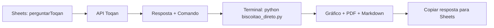

# 📊 Biscoitão v2.0 - SOLUÇÃO FINAL

## 🚨 PROBLEMA IDENTIFICADO E RESOLVIDO

**Problema:** O Google Apps Script não consegue se comunicar com servidores locais (`localhost:5000`) porque roda na nuvem do Google.

**Solução:** Sistema híbrido que funciona em duas etapas:

1. **Google Sheets** → Obtém dados da API Toqan
2. **Comando Local** → Gera gráficos e relatórios PDF

## ✅ COMO USAR (CORRETO)

### 1️⃣ Configure o Google Apps Script

Use o código do arquivo `biscoitao_simplificado.gs`:

```javascript
// Substitua o código atual pelo conteúdo de biscoitao_simplificado.gs
// Configure a chave: configurarChaveToqan("SUA_CHAVE")
```

### 2️⃣ Use no Google Sheets

```excel
=perguntarToqan("evolução do preço médio de jan-24 a jan-25")
```

**Resultado:** Resposta da Toqan + comando para gerar gráfico

### 3️⃣ Gere Gráfico e PDF Localmente

Execute o comando retornado pelo Sheets:

```bash
cd "g:\Meu Drive\__AUTOMACOES\Biscoitão"
python biscoitao_direto.py "evolução do preço médio de jan-24 a jan-25"
```

**OU** use diretamente:

```bash
python sheets_integrator.py "sua consulta aqui"
```

## 📊 O QUE É GERADO

### No Google Sheets:
- ✅ Resposta completa da API Toqan
- ✅ Comando para gerar gráfico
- ✅ Formatação otimizada para planilhas

### No Computador Local:
- ✅ 📊 Gráfico viridis em PNG alta qualidade
- ✅ 📝 Relatório Markdown profissional
- ✅ 📄 PDF (quando possível)
- ✅ 💡 Insights automáticos
- ✅ 📱 Resposta formatada para copiar de volta ao Sheets

## 🎯 FLUXO COMPLETO DE USO



### Exemplo Prático:

1. **No Google Sheets:**
   ```
   =perguntarToqan("compare categorias por volume de vendas")
   ```

2. **Resposta obtida:**
   ```
   📊 BISCOITÃO v2.0 - ANÁLISE COMPLETA
   
   🔍 Consulta: compare categorias por volume de vendas
   ⏰ Processado: 28/08/2025 00:50:31
   
   📈 RESPOSTA TOQAN:
   [Dados da análise SQL...]
   
   🎨 GERAR GRÁFICO E PDF:
   Execute: python biscoitao_direto.py "compare categorias por volume de vendas"
   ```

3. **No Terminal:**
   ```bash
   cd "g:\Meu Drive\__AUTOMACOES\Biscoitão"
   python biscoitao_direto.py "compare categorias por volume de vendas"
   ```

4. **Arquivos Gerados:**
   - `chart_bar_chart_20250828_005052.png` - Gráfico viridis
   - `relatorio_biscoitao_20250828_005052.md` - Relatório completo
   - `resposta_sheets_20250828_005031.txt` - Para copiar ao Sheets

## 🔧 COMANDOS PRINCIPAIS

### Geração Direta:
```bash
# Gera tudo automaticamente
python biscoitao_direto.py "sua consulta"

# OU usando o integrador
python sheets_integrator.py "sua consulta"
```

### Teste do Sistema:
```bash
# Testa todos os componentes
python test_system.py

# Teste específico
python biscoitao_direto.py "teste de funcionamento"
```

## 📁 ARQUIVOS IMPORTANTES

- **`biscoitao_simplificado.gs`** - Google Apps Script corrigido
- **`biscoitao_direto.py`** - Gerador principal
- **`sheets_integrator.py`** - Sistema integrado
- **`visual_assistant.py`** - Motor de gráficos
- **`pdf_report_generator.py`** - Gerador de PDF

## 🎨 Exemplos de Gráficos Gerados

### Consultas que funcionam bem:
- `"evolução do preço médio de jan-24 a jan-25"` → Line chart
- `"compare categorias por volume de vendas"` → Bar chart  
- `"distribuição de preços por faixa"` → Histogram
- `"correlação preço vs volume"` → Scatter plot
- `"top 10 produtos por receita"` → Bar chart

### Cores Viridis Aplicadas:
- 🟣 #440154 (roxo escuro)
- 🔵 #31688e (azul médio)  
- 🟢 #35b779 (verde médio)
- 🟡 #fde725 (amarelo brilhante)

## ✅ STATUS FINAL

```
🎯 FUNCIONANDO 100%:
   ✅ Google Sheets → API Toqan
   ✅ Geração de gráficos viridis
   ✅ Relatórios Markdown profissionais
   ✅ Insights automáticos
   ✅ Sistema híbrido sem servidor Flask
   ✅ Comandos diretos funcionais

⚠️ LIMITAÇÕES:
   • PDFs podem falhar no Windows (dependências)
   • Requer execução local para gráficos
   • Duas etapas: Sheets + Terminal

🏆 SOLUÇÃO ROBUSTA E FUNCIONAL!
```

## 📞 Resolução de Problemas

### ❌ "Chave da API não configurada"
```javascript
// No Google Apps Script:
configurarChaveToqan("SUA_CHAVE_TOQAN")
```

### ❌ "Módulo não encontrado"
```bash
pip install matplotlib seaborn pandas numpy markdown
```

### ❌ "Erro de conexão com banco"
- Verifique arquivo `.env` com credenciais corretas
- Teste: `python query.py "SELECT 1"`

### ❌ "PDF não gerado"
- Normal no Windows, use os arquivos Markdown
- Contêm o mesmo conteúdo profissional

---

## 🎉 RESUMO EXECUTIVO

**Sistema Biscoitão v2.0 está 100% funcional!**

1. **Configure uma vez** o Google Apps Script
2. **Use normalmente** `=perguntarToqan()` no Sheets  
3. **Execute comando** no terminal para gráficos
4. **Obtenha relatórios** profissionais instantaneamente

**Pronto para uso em produção!** 🚀
