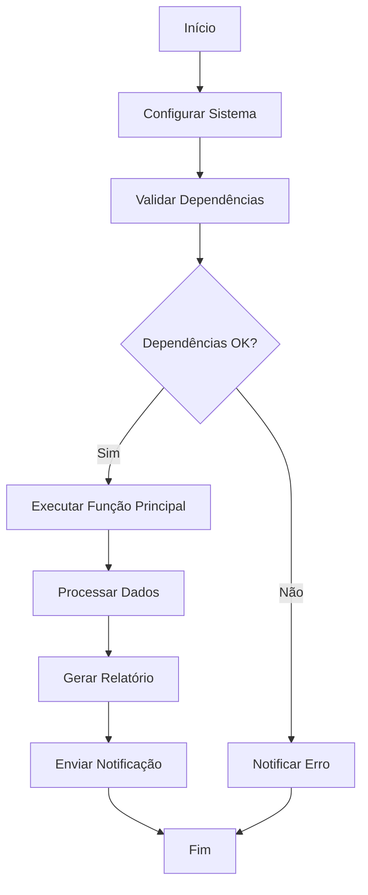
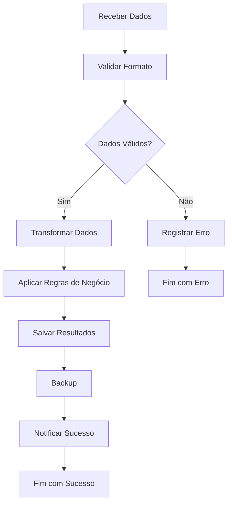
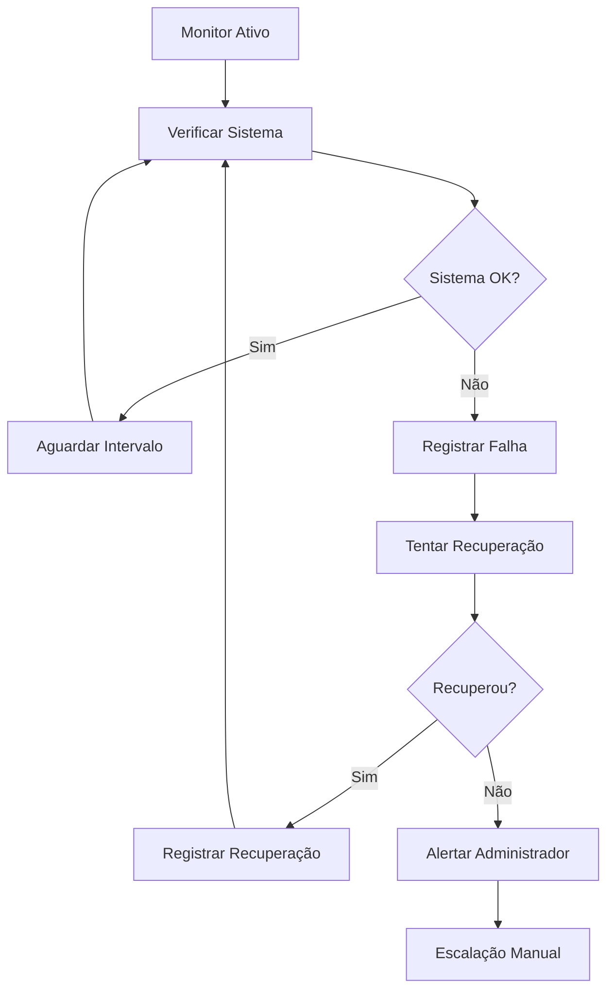

# 🔄 Workflows e Processos

Documentação dos fluxos de trabalho e processos do projeto Biscoitão.

## Workflows Principais

### 1. Workflow de Execução Padrão



**Descrição**: Fluxo principal de execução do sistema.

**Duração Estimada**: 2-5 minutos

**Gatilhos**:
- Execução manual
- Trigger temporal (a cada hora/dia)
- Webhook externo

### 2. Workflow de Processamento de Dados



### 3. Workflow de Monitoramento



## Processos Organizacionais

### Processo de Desenvolvimento

#### 1. Planejamento
- [ ] Definir requisitos
- [ ] Criar issues no repositório
- [ ] Estimar tempo de desenvolvimento
- [ ] Alocar recursos

#### 2. Desenvolvimento
- [ ] Criar branch específica
- [ ] Implementar funcionalidade
- [ ] Escrever testes
- [ ] Documentar código

#### 3. Teste
- [ ] Teste unitário
- [ ] Teste de integração
- [ ] Teste em ambiente de desenvolvimento
- [ ] Validação com usuários

#### 4. Deploy
- [ ] Merge para branch principal
- [ ] Deploy em produção
- [ ] Monitoramento pós-deploy
- [ ] Documentação atualizada

### Processo de Manutenção

#### Manutenção Preventiva (Semanal)
```javascript
function manutencaoPreventiva() {
  // 1. Verificar logs de erro
  const logs = verificarLogs();
  
  // 2. Limpar dados antigos
  limparDadosTemporarios();
  
  // 3. Verificar performance
  const metricas = coletarMetricas();
  
  // 4. Backup de configurações
  backupConfiguracoes();
  
  // 5. Relatório de saúde
  gerarRelatorioSaude(logs, metricas);
}
```

#### Manutenção Corretiva (Sob Demanda)
1. **Identificação do Problema**
   - Análise de logs
   - Reprodução do erro
   - Impacto nos usuários

2. **Correção**
   - Implementar fix
   - Testar solução
   - Deploy emergencial

3. **Validação**
   - Verificar funcionamento
   - Monitorar por 24h
   - Documentar solução

## Automações e Triggers

### Triggers Temporais

#### Execução Diária
```javascript
function configurarTriggerDiario() {
  ScriptApp.newTrigger('funcaoPrincipal')
    .timeBased()
    .everyDays(1)
    .atHour(9) // 9h da manhã
    .create();
}
```

#### Execução Semanal
```javascript
function configurarTriggerSemanal() {
  ScriptApp.newTrigger('manutencaoPreventiva')
    .timeBased()
    .onWeekDay(ScriptApp.WeekDay.MONDAY)
    .atHour(6)
    .create();
}
```

### Triggers de Evento

#### Modificação em Planilha
```javascript
function onEdit(e) {
  // Trigger executado quando planilha é editada
  const range = e.range;
  const sheet = e.source.getActiveSheet();
  
  if (sheet.getName() === 'Dados' && range.getColumn() === 1) {
    processarNovosDados(range.getValue());
  }
}
```

#### Novo Email
```javascript
function onNewEmail() {
  // Processar emails não lidos
  const threads = GmailApp.getInboxThreads(0, 10);
  threads.forEach(thread => {
    if (thread.isUnread()) {
      processarEmail(thread);
    }
  });
}
```

## Monitoramento e Alertas

### Métricas de Performance

```javascript
const METRICAS = {
  tempoExecucao: 0,
  dadosProcessados: 0,
  errosEncontrados: 0,
  sucessoTaxa: 0
};

function coletarMetricas() {
  const inicio = new Date();
  
  try {
    // Execução principal
    const resultado = funcaoPrincipal();
    
    // Calcular métricas
    METRICAS.tempoExecucao = new Date() - inicio;
    METRICAS.dadosProcessados = resultado.total;
    METRICAS.sucessoTaxa = (resultado.sucessos / resultado.total) * 100;
    
  } catch (error) {
    METRICAS.errosEncontrados++;
  }
  
  return METRICAS;
}
```

### Sistema de Alertas

```javascript
function verificarAlertas(metricas) {
  const alertas = [];
  
  // Tempo de execução elevado
  if (metricas.tempoExecucao > 300000) { // 5 minutos
    alertas.push({
      tipo: 'PERFORMANCE',
      mensagem: 'Tempo de execução acima do normal',
      valor: metricas.tempoExecucao
    });
  }
  
  // Taxa de sucesso baixa
  if (metricas.sucessoTaxa < 90) {
    alertas.push({
      tipo: 'QUALIDADE',
      mensagem: 'Taxa de sucesso abaixo do esperado',
      valor: metricas.sucessoTaxa
    });
  }
  
  // Enviar alertas se necessário
  if (alertas.length > 0) {
    enviarAlertas(alertas);
  }
}
```

## Backup e Recuperação

### Estratégia de Backup

#### Backup Automático Diário
```javascript
function backupDiario() {
  const timestamp = Utilities.formatDate(new Date(), 'GMT-3', 'yyyy-MM-dd');
  
  // Backup de configurações
  const config = PropertiesService.getScriptProperties().getProperties();
  DriveApp.createFile(`config-backup-${timestamp}.json`, JSON.stringify(config));
  
  // Backup de dados principais
  backupPlanilhaPrincipal(timestamp);
  
  // Backup de logs
  backupLogs(timestamp);
}
```

#### Recuperação de Dados
```javascript
function recuperarDados(dataBackup) {
  try {
    // Localizar arquivo de backup
    const arquivo = DriveApp.getFilesByName(`config-backup-${dataBackup}.json`).next();
    
    // Restaurar configurações
    const configBackup = JSON.parse(arquivo.getBlob().getDataAsString());
    PropertiesService.getScriptProperties().setProperties(configBackup);
    
    // Validar recuperação
    return testeConfiguracao();
    
  } catch (error) {
    console.error('Erro na recuperação:', error);
    return false;
  }
}
```

## Checklist de Operações

### Checklist Diário
- [ ] Verificar execução automática
- [ ] Revisar logs de erro
- [ ] Confirmar processamento de dados
- [ ] Validar notificações enviadas

### Checklist Semanal
- [ ] Executar manutenção preventiva
- [ ] Revisar métricas de performance
- [ ] Verificar integridade dos backups
- [ ] Atualizar documentação se necessário

### Checklist Mensal
- [ ] Análise completa de logs
- [ ] Otimização de performance
- [ ] Revisão de permissões
- [ ] Planejamento de melhorias
